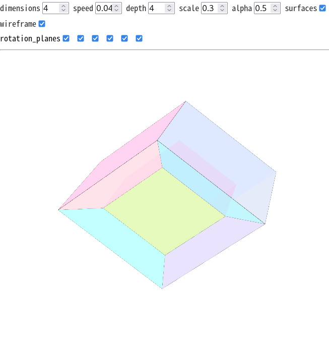

# rotating n-cube projections using webgl and conformal geometric algebra



[demo](https://sph.mn/files/u/software/sourcecode/cga-hypercubes/src/main.html)
## overview
* cga point representation
* rotor-based rotation
* staged projection from `n` to `3`
* webgl rasterization

## formulas
### rotation
```
rotor = cos(angle / 2) - plane * sin(angle / 2)
p_rotated = rotor * p * inverse(rotor)
```

variables
* `angle` = rotation angle
* `plane` = unit euclidean bivector
* `rotor` = rotation multivector
* `p` = conformal point

### projection
for stage `m -> m - 1`:
```
scale = depth[m] / (depth[m] - x_current[m])
x_next[i] = scale * x_current[i]
```
apply for:
```
m = n, n - 1, ..., 4
```
final:
```
position_3d = [x_current[1], x_current[2], x_current[3]]
```
variables
* `x_current` = euclidean coordinates
* `depth[m]` = projection distance

## info
* compiled javascript files: `src/compiled/`
* source files: `src/*.coffee` (requires [coffeescript](http://coffeescript.org/), `npm install coffeescript`)
* deployment: serve the project directory via http and open `main.html`

## dependencies
* [sph-ga](https://github.com/sph-mn/sph-ga)
* [crel](https://github.com/KoryNunn/crel)
